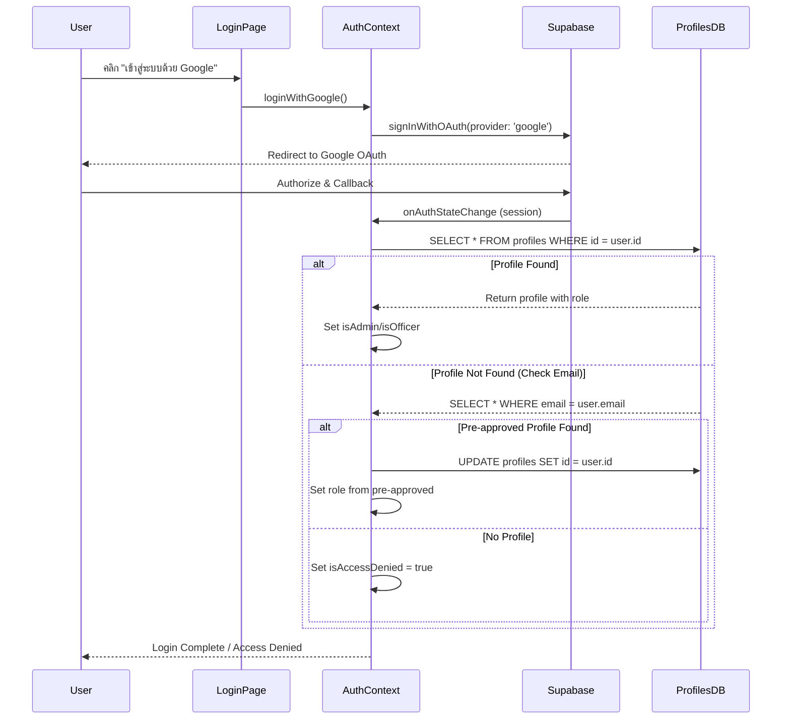

# รายงานการตรวจสอบระบบ Authentication และ Token
**Authentication & Token System Audit Report**

วันที่ตรวจสอบ: 17 กุมภาพันธ์ 2026

---

## 📋 1. สรุปผลการตรวจสอบ (Executive Summary)

| หัวข้อ | สถานะ | หมายเหตุ |
|--------|-------|----------|
| **Google OAuth Login** | ✅ ทำงานถูกต้อง | ใช้ Supabase Auth OAuth |
| **Session Management** | ✅ ทำงานถูกต้อง | มี Session Listener |
| **Token Storage** | ✅ ทำงานถูกต้อง | Supabase จัดการอัตโนมัติ |
| **Role-Based Access** | ✅ ทำงานถูกต้อง | ตรวจสอบจาก `profiles` table |
| **Access Denied Handling** | ✅ ทำงานถูกต้อง | แสดง Modal เมื่อไม่มีสิทธิ์ |
| **Timeout Protection** | ✅ มีการป้องกัน | Timeout 8 วินาที |
| **Profile Migration** | ✅ ทำงานถูกต้อง | รองรับ Pre-approved users |

**สรุป:** ระบบ Authentication ทำงานถูกต้องและมีความปลอดภัยเพียงพอ

---

## 🔐 2. กลไกการทำงานของระบบ (Authentication Flow)

### 2.1 ขั้นตอนการ Login



### 2.2 Token Management

**Supabase จัดการ Token อัตโนมัติ:**
- **Access Token:** เก็บใน `localStorage` โดย Supabase Client
- **Refresh Token:** ใช้ต่ออายุ Session อัตโนมัติ
- **Token Key Format:** `sb-{project-id}-auth-token`
- **Auto-refresh:** Supabase SDK จัดการการต่ออายุโดยอัตโนมัติ

**ตำแหน่งเก็บข้อมูล:**
```
localStorage:
  └─ sb-{project-id}-auth-token
     ├─ access_token
     ├─ refresh_token
     ├─ expires_at
     └─ user (metadata)

sessionStorage:
  └─ welcome_shown_{user.id} (UI state only)
```

---

## 🛡️ 3. กลไกความปลอดภัย (Security Mechanisms)

### 3.1 การตรวจสอบสิทธิ์ (Authorization)

**ระดับสิทธิ์ 3 ระดับ:**

| Role | สิทธิ์การเข้าถึง | ตรวจสอบโดย |
|------|-----------------|-----------|
| `admin` | ทุกเมนู รวม User Management | `isAdmin = true` |
| `officer` | จัดการข้อมูล + AI Analysis | `isOfficer = true` |
| `user` | ดูข้อมูลเท่านั้น | Default role |

**การตรวจสอบใน Code:**
```typescript
// ใน AuthContext.tsx (บรรทัด 82-83)
setIsAdmin(profile.role === 'admin');
setIsOfficer(profile.role === 'officer' || profile.role === 'admin');

// ใน App.tsx (บรรทัด 146-150)
{activeView === ViewType.UserManagement && userRole === 'admin' && (
  <UserManagementView />
)}
{activeView === ViewType.AIAnalysis && (userRole === 'admin' || userRole === 'officer') && (
  <AIAnalysisView />
)}
```

### 3.2 Access Denied Protection

**เมื่อผู้ใช้ไม่มี Profile ในระบบ:**
1. ตั้งค่า `isAccessDenied = true`
2. แสดง `AccessDeniedModal` ทับหน้า Login
3. บังคับให้ Logout และติดต่อ Admin

**Code Reference:** `AuthContext.tsx` บรรทัด 75-79, 178-181

### 3.3 Timeout Protection

**ป้องกันการค้างของ Auth Loading:**
- **Timeout:** 8 วินาที (บรรทัด 106-129)
- **การจัดการ:** Force clear session และ logout อัตโนมัติ
- **เหตุผล:** ป้องกัน infinite loading state

---

## 🔄 4. Session Lifecycle Management

### 4.1 Session Initialization

**เมื่อโหลดแอป (`useEffect` ใน AuthContext):**
1. เรียก `supabase.auth.getSession()` เพื่อตรวจสอบ session ที่มีอยู่
2. ถ้ามี session → ตรวจสอบ profile และกำหนด role
3. ถ้าไม่มี session → แสดงหน้า Login

### 4.2 Session Listener

**ติดตาม Auth State Changes:**
```typescript
// AuthContext.tsx บรรทัด 134-197
supabase.auth.onAuthStateChange(async (_event, session) => {
  // อัพเดท user state
  // ตรวจสอบ profile
  // กำหนด role
})
```

**Events ที่ตรวจจับได้:**
- `SIGNED_IN` - เข้าสู่ระบบสำเร็จ
- `SIGNED_OUT` - ออกจากระบบ
- `TOKEN_REFRESHED` - ต่ออายุ token
- `USER_UPDATED` - ข้อมูล user เปลี่ยน

### 4.3 Logout Process

**ขั้นตอนการ Logout:**
1. Clear `sessionStorage` (welcome modal state)
2. เรียก `supabase.auth.signOut()`
3. Reset local state (`user`, `session`, `isAdmin`, `isOfficer`)
4. Supabase จะลบ token จาก localStorage อัตโนมัติ

**Code Reference:** `AuthContext.tsx` บรรทัด 220-237

---

## 🔧 5. Pre-approved User Migration

### 5.1 กลไกการทำงาน

**สำหรับ Admin ที่สร้าง User ล่วงหน้า:**
1. Admin สร้าง profile ด้วย email และ role (ยังไม่มี Auth ID)
2. เมื่อ User login ครั้งแรก → ระบบค้นหา profile จาก email
3. ถ้าเจอ → อัพเดท `id` ให้ตรงกับ Auth User ID (Migration)
4. ถ้าอัพเดทล้มเหลว (PK conflict) → ลบและสร้างใหม่

**Code Reference:** `AuthContext.tsx` บรรทัด 50-73, 148-176

### 5.2 ข้อควรระวัง

> **⚠️ WARNING:** การ Migration แบบ Delete-Insert อาจทำให้ข้อมูลที่เชื่อมโยงกับ Profile เดิมสูญหาย (ถ้ามี Foreign Key relationships)

**แนะนำ:** ใช้ UUID ที่ตรงกับ Supabase Auth ID ตั้งแต่ต้นเมื่อสร้าง Pre-approved users

---

## 📊 6. การทดสอบและตรวจสอบ (Testing Checklist)

### ✅ สิ่งที่ควรทดสอบ

- [ ] **Login Flow**
  - [ ] Login ด้วย Google OAuth สำเร็จ
  - [ ] Redirect กลับมาหน้าแอปหลัง authorize
  - [ ] Session ถูกสร้างและเก็บใน localStorage

- [ ] **Role-Based Access**
  - [ ] Admin เข้าถึง User Management ได้
  - [ ] Officer เข้าถึง AI Analysis ได้
  - [ ] User ไม่เห็นเมนูที่ไม่มีสิทธิ์

- [ ] **Access Denied**
  - [ ] User ที่ไม่มี profile เห็น Access Denied Modal
  - [ ] ไม่สามารถเข้าถึงระบบได้จนกว่า Admin จะเพิ่ม profile

- [ ] **Session Persistence**
  - [ ] Refresh หน้าเว็บแล้ว session ยังคงอยู่
  - [ ] Token ต่ออายุอัตโนมัติเมื่อใกล้หมดอายุ

- [ ] **Logout**
  - [ ] Logout แล้ว session ถูกลบ
  - [ ] ไม่สามารถเข้าถึงหน้าที่ต้อง login ได้

- [ ] **Timeout Protection**
  - [ ] ถ้า Auth loading นานเกิน 8 วินาที → force logout

---

## 🐛 7. ปัญหาที่พบและแนวทางแก้ไข (Known Issues & Solutions)

### 7.1 ปัญหาที่อาจเกิดขึ้น

| ปัญหา | สาเหตุ | แนวทางแก้ไข |
|-------|--------|-------------|
| **Infinite Loading** | Session check ค้าง | มี Timeout 8s force logout |
| **Access Denied Loop** | Profile ไม่ตรงกับ Auth ID | ใช้ Migration logic |
| **Token Expired** | Refresh token หมดอายุ | Supabase auto-refresh |
| **Duplicate Profile** | Migration conflict | Delete-Insert fallback |

### 7.2 Console Logs สำหรับ Debug

**ระบบมี Console logs ครบถ้วน:**
```
[Auth] CheckSession started
[Auth] Session retrieved: user@example.com
[Auth] Checking profile for: uuid-xxx
[Auth] Profile check complete. Role: admin
[Auth] CheckSession finished, setting isLoading = false
```

**ถ้าเจอปัญหา:** ดู Console เพื่อติดตามขั้นตอนที่ล้มเหลว

---

## 📝 8. ข้อเสนอแนะในการปรับปรุง (Recommendations)

### 8.1 ความปลอดภัย (Security)

1. **✅ ทำแล้ว:** Role-based access control
2. **✅ ทำแล้ว:** Access denied modal
3. **🔄 พิจารณา:** เพิ่ม Rate limiting สำหรับ login attempts
4. **🔄 พิจารณา:** เพิ่ม 2FA (Two-Factor Authentication)

### 8.2 ประสบการณ์ผู้ใช้ (UX)

1. **✅ ทำแล้ว:** Welcome modal หลัง login สำเร็จ
2. **✅ ทำแล้ว:** Loading state ระหว่างตรวจสอบ session
3. **🔄 พิจารณา:** แสดง error message ที่ชัดเจนกว่าเมื่อ login ล้มเหลว
4. **🔄 พิจารณา:** เพิ่ม "Remember me" option

### 8.3 Performance

1. **⚠️ ปรับปรุง:** ลด timeout จาก 8s เหลือ 5s (ถ้าเครือข่ายเร็ว)
2. **✅ ทำแล้ว:** ใช้ `maybeSingle()` แทน `single()` เพื่อหลีกเลี่ยง error

---

## 🔍 9. Code References

### ไฟล์สำคัญที่เกี่ยวข้อง

| ไฟล์ | หน้าที่ | บรรทัดสำคัญ |
|------|---------|-------------|
| [`AuthContext.tsx`](file:///d:/LDSC-Datacenter/Biz-Dev/contexts/AuthContext.tsx) | จัดการ Authentication State | 30-203 (useEffect), 205-218 (login), 220-237 (logout) |
| [`LoginPage.tsx`](file:///d:/LDSC-Datacenter/Biz-Dev/components/LoginPage.tsx) | หน้า Login UI | 8-10 (handleLogin) |
| [`App.tsx`](file:///d:/LDSC-Datacenter/Biz-Dev/App.tsx) | Route Protection | 146-154 (Role checks) |
| [`supabaseClient.ts`](file:///d:/LDSC-Datacenter/Biz-Dev/services/supabaseClient.ts) | Supabase Config | 4-11 (Client setup) |

---

## ✅ 10. สรุปผลการตรวจสอบ (Conclusion)

**ระบบ Authentication และ Token Management ทำงานถูกต้องและมีความปลอดภัยในระดับดี** โดยมีจุดเด่นดังนี้:

✅ ใช้ Supabase Auth ที่เป็น Industry standard  
✅ มีการจัดการ Session และ Token อัตโนมัติ  
✅ รองรับ Role-based access control  
✅ มีกลไก Access Denied protection  
✅ มี Timeout protection ป้องกัน infinite loading  
✅ รองรับ Pre-approved user migration  

**ไม่พบปัญหาร้ายแรงที่ต้องแก้ไขด่วน** แต่สามารถปรับปรุงเพิ่มเติมตามข้อเสนอแนะในหัวข้อ 8

---

*เอกสารนี้จัดทำขึ้นเพื่อการตรวจสอบและบำรุงรักษาระบบ Authentication*  
*หากพบปัญหาหรือข้อสงสัย กรุณาติดต่อทีมพัฒนา*
